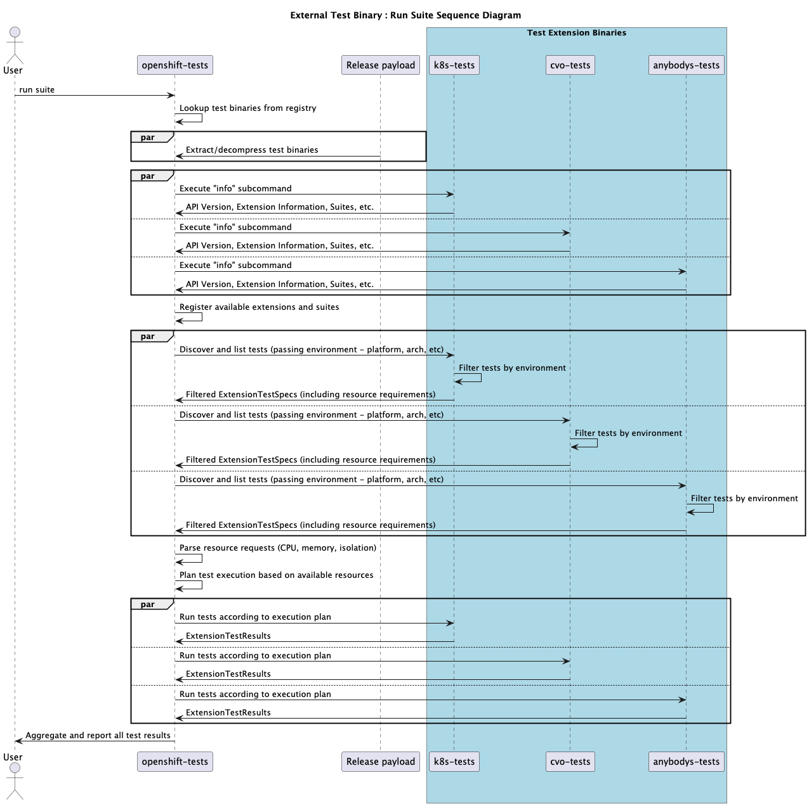

# openshift-tests-extension

openshift-tests-extension is a framework that allows external
repositories to contribute tests to openshift-tests' suites with
extension binaries. It provides a standardized interface for test
discovery, execution, and result aggregation, allowing decentralized
test contributions while maintaining centralized orchestration.

It is part of the implementation for [this
enhancement](https://github.com/openshift/enhancements/pull/1676).

See [cmd/example-tests](cmd/example-tests/main.go) for an example of
how to integrate this with your project.

